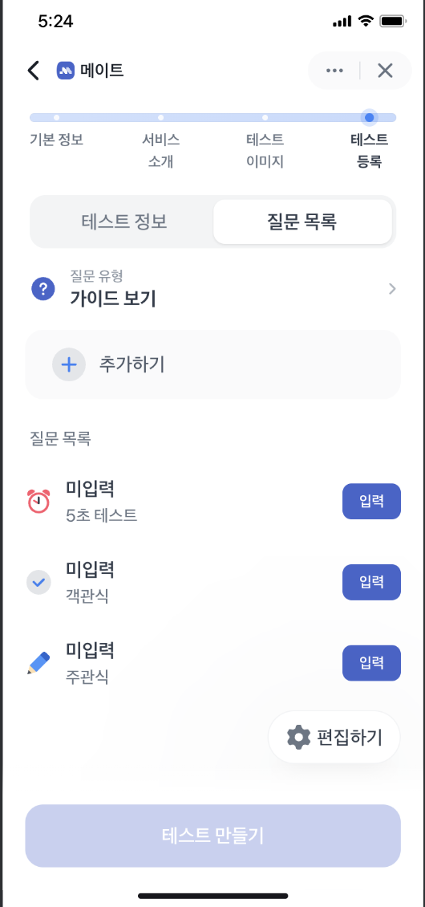
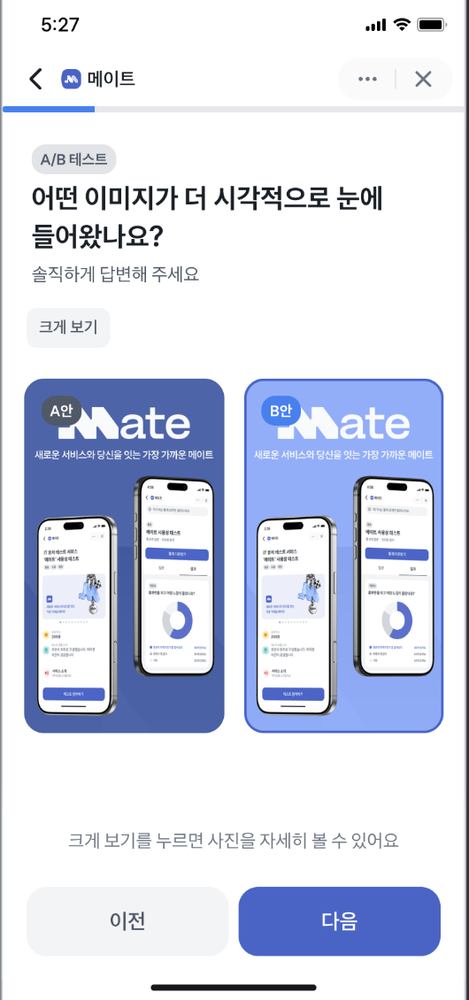
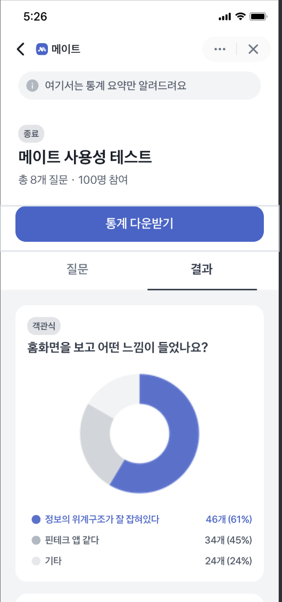

# MATE FE


세상에 막 발을 내딛는 신규 서비스 **MAKER**와, 새로운 서비스를 가장 먼저 경험하고 싶은 **TESTER**를 이어주는 앱인토스 기반 테스트 리워드 플랫폼입니다.

메이커는 진짜 유저로부터 유의미한 피드백을 얻고, 테스터는 자신의 피드백 가치를 토스 포인트로 돌려받는 선순환 구조를 지향합니다.

---

## 주요 기능

|                           탐색                           |                      생성                      |
| :------------------------------------------------------: | :--------------------------------------------: |
|                                    |                        |
| 참여 가능한 테스트를 탐색하고<br/>상세 정보를 확인합니다 | 7가지 질문 유형으로<br/>테스트를 직접 만듭니다 |

|                        참여                         |                            보고서                            |
| :-------------------------------------------------: | :----------------------------------------------------------: |
|                             |                                      |
| 테스트에 응답하고<br/>토스 포인트 리워드를 받습니다 | 응답 결과를 차트로 확인하고<br/>PDF와 Excel로 다운로드합니다 |

---

## 기술 스택

### 개발

|                |                                                  |
| -------------- | ------------------------------------------------ |
| 패키지 매니저  | pnpm                                             |
| 빌드           | Vite + React 18 + TypeScript                     |
| 플랫폼         | 앱인토스 Granite Web Framework                   |
| 라우팅         | TanStack Router                                  |
| HTTP           | ky                                               |
| 서버 상태      | TanStack Query v5                                |
| API 코드 생성  | orval (Swagger → TanStack Query hooks 자동 생성) |
| 전역 상태      | Zustand v5                                       |
| 스타일         | Tailwind CSS v4 + TDS (`@toss/tds-mobile`)       |
| 애니메이션     | Framer Motion                                    |
| 드래그 앤 드롭 | dnd-kit                                          |
| 차트           | Chart.js + react-chartjs-2                       |

### 인프라

|            |                                                   |
| ---------- | ------------------------------------------------- |
| 환경변수   | Doppler                                           |
| E2E 테스트 | Playwright                                        |
| PDF 생성   | Node.js + Playwright Chromium (서버사이드 렌더링) |

---

## 프로젝트 구조

```
src/
├── routes/          # 페이지 라우트 (TanStack Router)
├── features/        # 도메인별 기능
│   ├── test-create/         # 테스트 생성 퍼널
│   ├── test-participate/    # 테스트 참여 퍼널
│   ├── test-result/         # 통계보고서
│   ├── question-multiple/   # 객관식
│   ├── question-subjective/ # 주관식
│   ├── question-fivesec/    # 5초 테스트
│   ├── question-scale/      # 척도
│   ├── question-ab/         # A/B 테스트
│   ├── question-cardsort/   # 카드 소팅
│   └── question-tree/       # 트리 테스트
└── shared/
    ├── api/         # ky 인스턴스, orval 생성 코드
    ├── ui/          # 공용 컴포넌트
    ├── hooks/       # 공용 훅
    └── lib/         # 유틸
```

---

## 시작하기

> 자세한 온보딩은 [`docs/TEAM_ONBOARDING.md`](docs/TEAM_ONBOARDING.md) 를 참고하세요.

### 1. 의존성 설치

```bash
pnpm install
```

### 2. Doppler 연결 (최초 1회)

```bash
doppler login
pnpm doppler:setup
```

### 3. 개발 서버 실행

```bash
pnpm dev          # Doppler 환경변수 포함
pnpm dev:plain    # Doppler 없이 실행
```

---

## 주요 명령어

```bash
pnpm dev             # 개발 서버
pnpm build           # 앱인토스 빌드
pnpm lint            # ESLint
pnpm orval           # API 코드 재생성 (Swagger 스펙 변경 시)
pnpm test:e2e        # E2E 테스트 (헤드리스)
pnpm test:e2e:ui     # E2E 테스트 (UI 모드)
pnpm pdf:server      # PDF 생성 서버 실행 (port 3001)
```

---

## Git 규칙

|         |                                                           |
| ------- | --------------------------------------------------------- |
| 브랜치  | `type/#이슈번호` (예: `feat/#12`)                         |
| 커밋    | Conventional Commits (`feat`, `fix`, `refactor`, `chore`) |
| PR 제목 | `[TYPE] 한 줄 요약`                                       |
| 머지    | Squash Merge                                              |

---

## 문서

- [`docs/TEAM_ONBOARDING.md`](docs/TEAM_ONBOARDING.md) — 로컬 환경 세팅
- [`docs/DOPPLER.md`](docs/DOPPLER.md) — 환경변수 상세
- [`CLAUDE.md`](CLAUDE.md) — AI 작업 규칙
